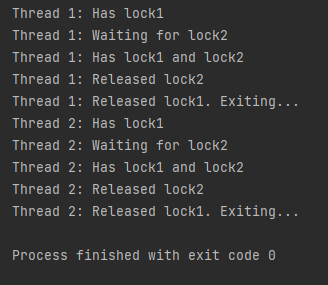

# DeadLocks
using 2 threads with 2 different locks, properly showing how to avoid a deadlock

Deadlocks

A deadlock occurs when two or more sessions are waiting for data locked by each other, resulting in all the sessions being blocked. 
Typically, deadlocks are caused by poorly implemented locking in application code. 

